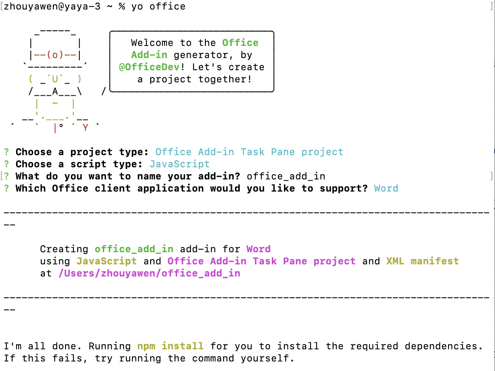
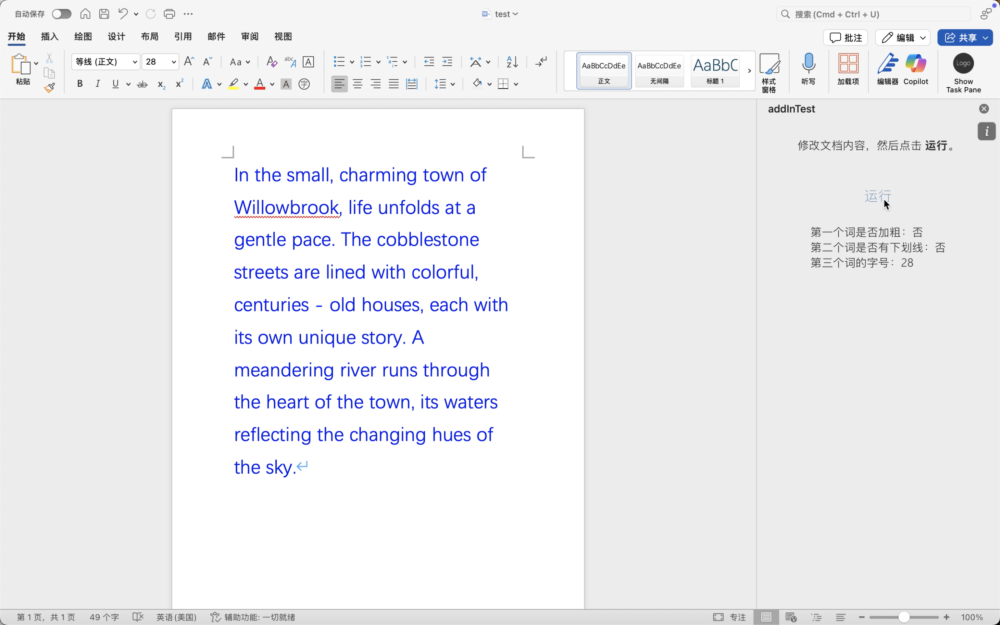

# 项目简介
Office Add-ins 实践：使用Word JavaScript API判断文档的第一个词是否加粗，第二个词是否有下划线，以及获取第三个词的字号。

# 环境配置两种方式
参考文档：https://learn.microsoft.com/zh-cn/office/dev/add-ins/overview/set-up-your-dev-environment?view=word-js-preview&tabs=yeomangenerator  
node环境：npm install -g yo generator-office  
vscode：安装插件 Office Add-ins Development Kit  

# 初始化项目两种方式
命令行：$ yo office  
插件：点击按钮 Create a New Add-in

# 初始化选项
project type：Office Add-in Task Pano project  
script type：JavaScript  
name：office_add_in  
office client application：Word  

# 安装依赖
$ npm i

# 业务逻辑
目录 src/taskpane  
使用Word JavaScript API判断文档的第一个词是否加粗，第二个词是否有下划线，以及获取第三个词的字号。 

# 代码侧运行
$ npm run start  
或者插件运行，点击 Get Started  

# Word文档侧运行效果

